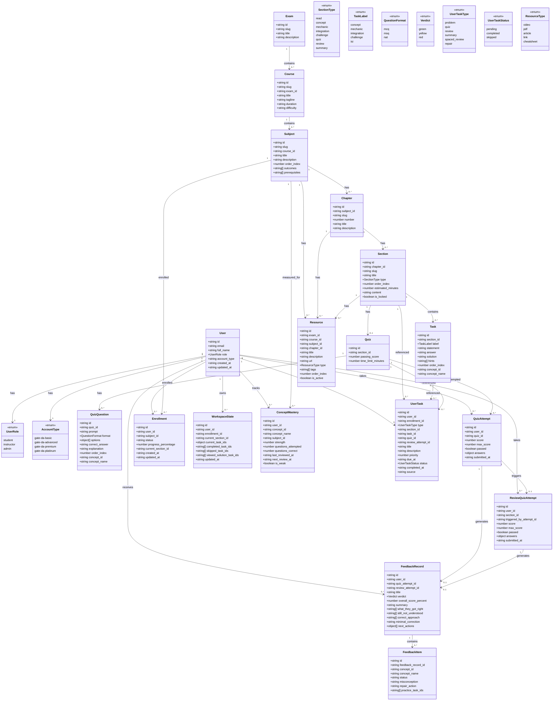
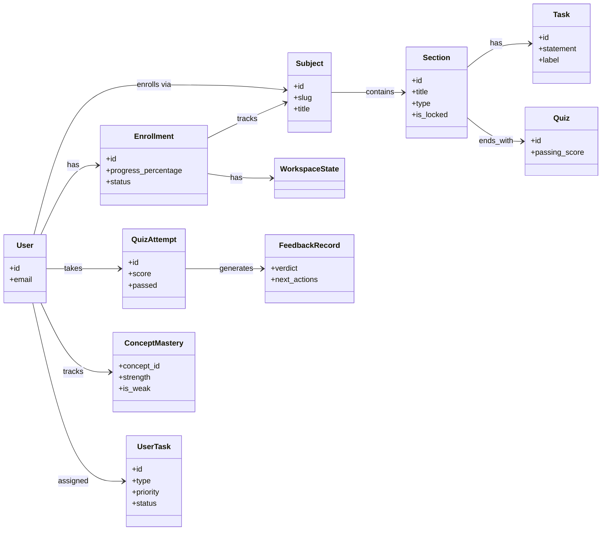

# aleph — TypeScript / Database Class Diagram

> **Purpose:** Visual reference for the entities used by aleph v2. Derived from `src/lib/data-models.ts` and the current Supabase schema.

---

## Complete Domain Model (Mermaid)

---

## Simplified Learning Loop

---

## Key Relationships Summary

| From | To | Cardinality | Meaning |
|------|-----|-------------|---------|
| `User` | `Enrollment` | 1:N | A user enrolls in many subjects |
| `User` | `WorkspaceState` | 1:N | One workspace state per enrollment |
| `User` | `QuizAttempt` | 1:N | Many section quiz attempts |
| `User` | `ReviewQuizAttempt` | 1:N | Many review attempts |
| `User` | `ConceptMastery` | 1:N | Per-concept strength |
| `User` | `FeedbackRecord` | 1:N | Feedback per attempt |
| `User` | `UserTask` | 1:N | Dashboard next-actions |
| `Exam` | `Course` | 1:N | Exam contains courses |
| `Course` | `Subject` | 1:N | Course contains subjects |
| `Subject` | `Chapter` | 1:N | Subject has chapters |
| `Chapter` | `Section` | 1:N | Chapter has sections |
| `Section` | `Task` | 1:N | Section has problems |
| `Section` | `Quiz` | 1:1 | Gated section ends with one quiz |
| `Quiz` | `QuizQuestion` | 1:N | Quiz has questions |
| `Quiz` | `QuizAttempt` | 1:N | Quiz is attempted |
| `QuizAttempt` | `ReviewQuizAttempt` | 1:0..1 | Failed attempt triggers review |
| `QuizAttempt` / `ReviewQuizAttempt` | `FeedbackRecord` | 1:1 | Each attempt generates feedback |
| `FeedbackRecord` | `FeedbackItem` | 1:N | Per-concept repair actions |
| `Subject` | `Resource` | 1:N | Reference material |

---

*Last updated: 2026-06-19*
*See also: [schema.md](schema.md) for SQL definitions, [data-flow.md](data-flow.md) for interaction flows.*
