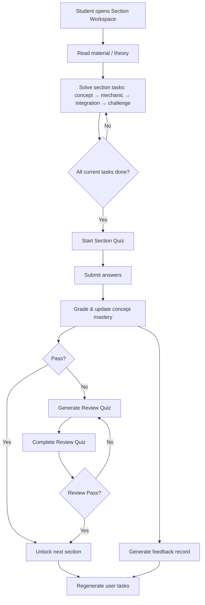
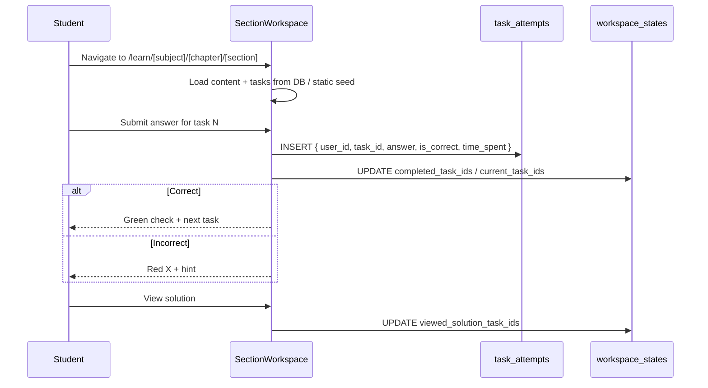
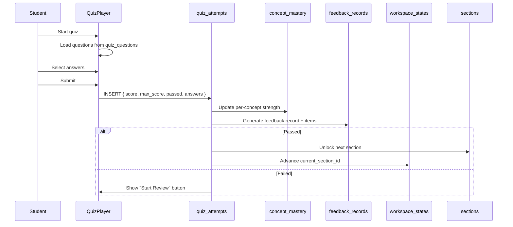
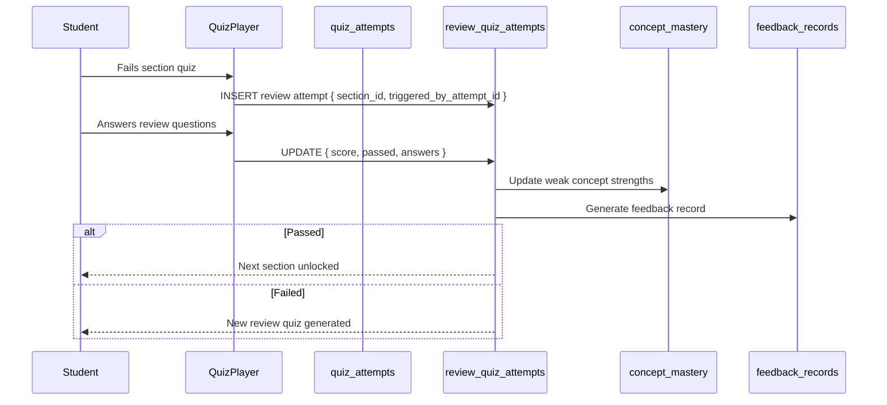
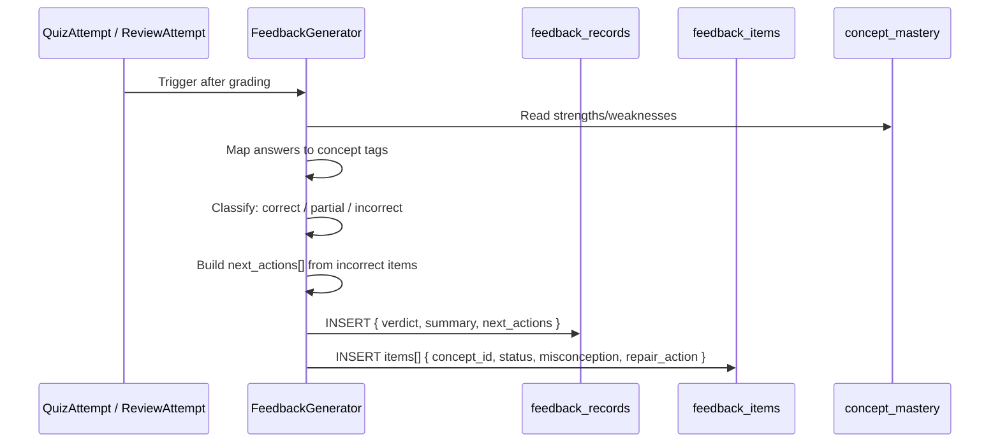
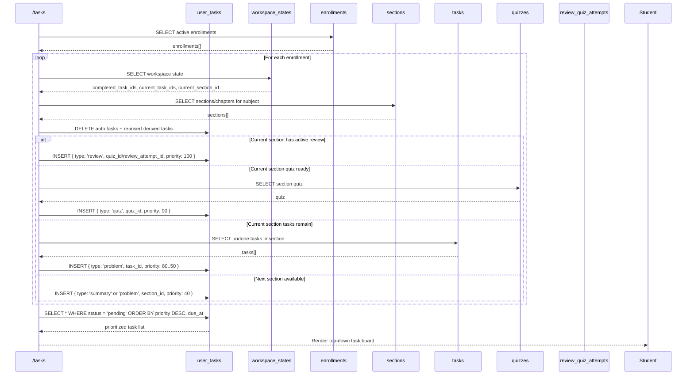
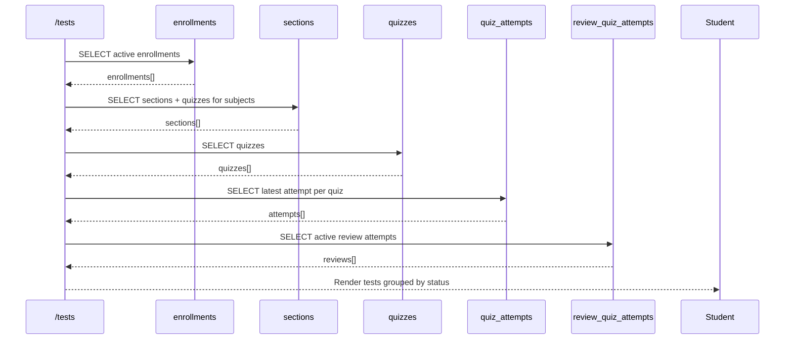
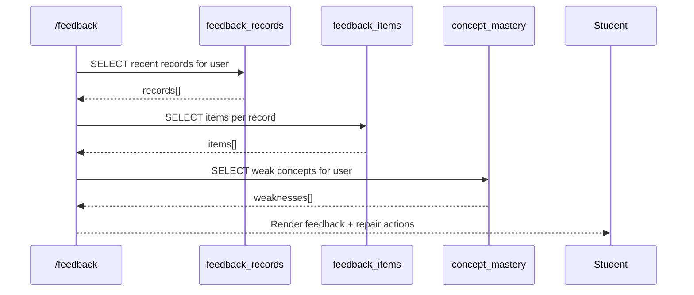
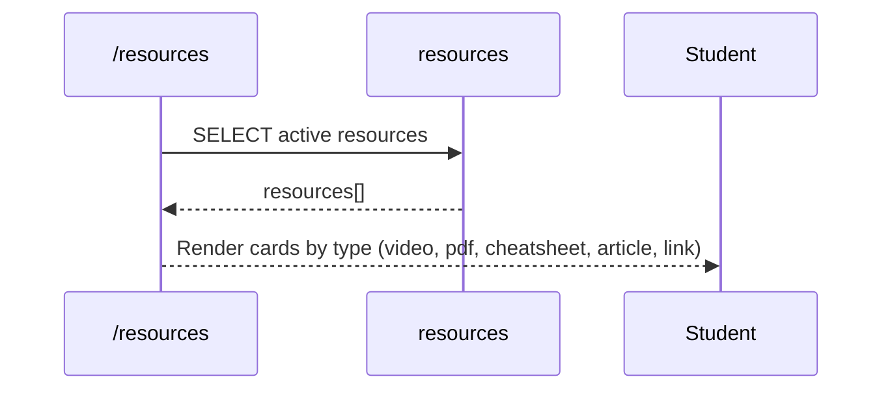
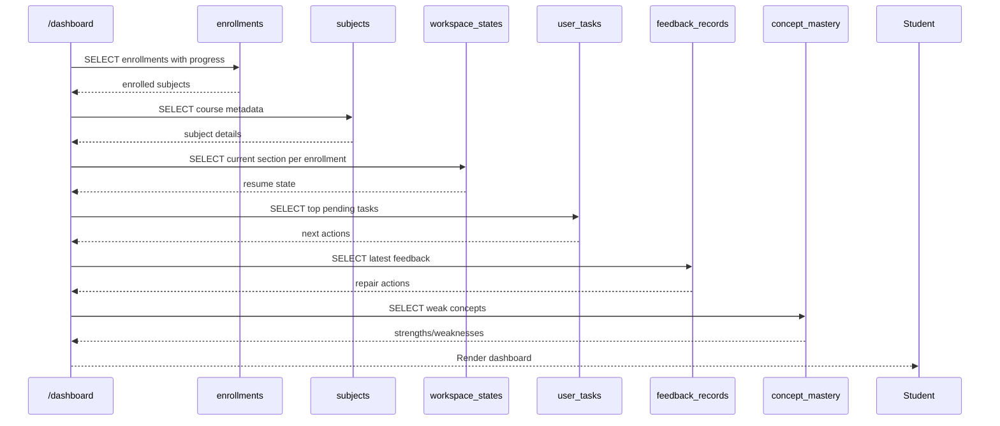

# aleph — Data Flow

> **Purpose:** How data moves through the core learning loop, dashboard, tests, tasks, and feedback systems.

---

## 1. Core Learning Loop

---

## 2. Problem Solving Flow

### Mutations

| Table | Operation | When |
|-------|-----------|------|
| `task_attempts` | INSERT | Answer submitted |
| `workspace_states` | UPDATE | Task completed / solution viewed |
| `concept_mastery` | UPSERT | Correct/incorrect updates strength |

---

## 3. Section Quiz Flow

### Mutations

| Table | Operation | When |
|-------|-----------|------|
| `quiz_attempts` | INSERT | Quiz submitted |
| `concept_mastery` | UPSERT | Strength updated |
| `feedback_records` / `feedback_items` | INSERT | Feedback generated |
| `sections` | UPDATE | Next section unlocked |
| `workspace_states` | UPDATE | Current section advances |
| `enrollments` | UPDATE | progress_percentage recalculated |

---

## 4. Review Quiz Flow

---

## 5. Feedback Generation Flow

### Feedback → Tasks

Each `feedback_record.next_actions` entry becomes a `user_tasks` row with:

- `type = 'repair'`
- `priority = high`
- `section_id` / `task_id` pointing to the repair problem

---

## 6. Dashboard Tasks / Next-Actions Flow

The **Tasks** page is not a static list. It is rebuilt from the user’s live workspace.

### Priority rules

1. `review` — blocks progress, highest priority
2. `quiz` — section quiz ready
3. `problem` — current section tasks, ordered by label
4. `summary` — next unread section
5. `spaced_review` — due review items
6. `repair` — from latest feedback

---

## 7. Tests Flow

The **Tests** page shows every quiz-like activity for the user.

### Test status rules

| Status | Condition |
|--------|-----------|
| `available` | Section unlocked + quiz not yet passed |
| `in_review` | Failed section quiz → review quiz active |
| `completed` | Quiz passed |
| `locked` | Section still locked |

---

## 8. Feedback Flow

---

## 9. Resources Flow

---

## 10. Dashboard Update Flow

---

## Mutation Summary

| User Action | Tables Modified | Side Effects |
|-------------|-----------------|--------------|
| Submit task answer | `task_attempts`, `workspace_states` | Update `concept_mastery` |
| View solution | `workspace_states` | Mark viewed |
| Submit section quiz | `quiz_attempts`, `feedback_records`, `feedback_items` | Unlock next section, update mastery, regenerate `user_tasks` |
| Submit review quiz | `review_quiz_attempts`, `feedback_records` | Update mastery, unlock if passed |
| Complete task | `workspace_states` | Regenerate `user_tasks` |
| Skip task | `workspace_states` | Move to next task |
| Enroll in subject | `enrollments`, `workspace_states` | Seed initial `user_tasks` |
| Update profile | `profiles` | — |

---

*Last updated: 2026-06-19*
*See also: [schema.md](schema.md), [class-diagram.md](class-diagram.md).*
