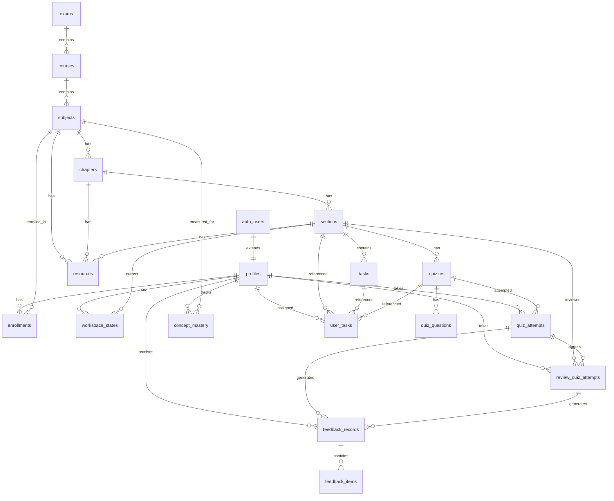

# aleph — Database Schema

> **Purpose:** Single source of truth for the Supabase schema used by aleph v2. Reflects the migrations in `supabase/migrations/`.

---

## ER Diagram (Mermaid)



---

## Table Definitions

### `exams`

Top-level exam (GATE DA, ISI, CMI, etc.).

```sql
CREATE TABLE exams (
  id UUID PRIMARY KEY DEFAULT gen_random_uuid(),
  slug TEXT UNIQUE NOT NULL,
  title TEXT NOT NULL,
  description TEXT,
  created_at TIMESTAMPTZ DEFAULT NOW()
);
```

### `courses`

A course belongs to one exam and groups subjects.

```sql
CREATE TABLE courses (
  id UUID PRIMARY KEY DEFAULT gen_random_uuid(),
  slug TEXT UNIQUE NOT NULL,
  exam_id UUID REFERENCES exams(id) ON DELETE CASCADE,
  title TEXT NOT NULL,
  tagline TEXT,
  duration TEXT,
  difficulty TEXT,
  created_at TIMESTAMPTZ DEFAULT NOW()
);
```

### `subjects`

A subject is the unit a learner enrolls in (e.g. “Probability & Statistics”).

```sql
CREATE TABLE subjects (
  id UUID PRIMARY KEY DEFAULT gen_random_uuid(),
  slug TEXT UNIQUE NOT NULL,
  course_id UUID REFERENCES courses(id) ON DELETE CASCADE,
  title TEXT NOT NULL,
  description TEXT,
  order_index INT NOT NULL DEFAULT 0,
  outcomes TEXT[] DEFAULT '{}',
  prerequisites TEXT[] DEFAULT '{}',
  created_at TIMESTAMPTZ DEFAULT NOW()
);
```

### `chapters`

```sql
CREATE TABLE chapters (
  id UUID PRIMARY KEY DEFAULT gen_random_uuid(),
  subject_id UUID REFERENCES subjects(id) ON DELETE CASCADE NOT NULL,
  slug TEXT NOT NULL,
  number INT NOT NULL,
  title TEXT NOT NULL,
  description TEXT,
  created_at TIMESTAMPTZ DEFAULT NOW(),
  UNIQUE(subject_id, slug)
);
```

### `sections`

The smallest navigable learning unit.

```sql
CREATE TABLE sections (
  id UUID PRIMARY KEY DEFAULT gen_random_uuid(),
  chapter_id UUID REFERENCES chapters(id) ON DELETE CASCADE NOT NULL,
  slug TEXT NOT NULL,
  title TEXT NOT NULL,
  type TEXT NOT NULL CHECK (type IN (
    'read', 'concept', 'mechanic', 'integration',
    'challenge', 'quiz', 'review', 'summary'
  )),
  order_index INT NOT NULL DEFAULT 0,
  estimated_minutes INT DEFAULT 0,
  content TEXT DEFAULT '',
  reading_questions JSONB DEFAULT '[]',
  is_locked BOOLEAN DEFAULT false,
  created_at TIMESTAMPTZ DEFAULT NOW(),
  UNIQUE(chapter_id, slug)
);
```

**Locking philosophy:** Most sections are unlocked by default. A section’s **quiz** is the gate; passing it unlocks the next section.

---

### `tasks`

A single problem or exercise inside a section.

```sql
CREATE TABLE tasks (
  id UUID PRIMARY KEY DEFAULT gen_random_uuid(),
  section_id UUID REFERENCES sections(id) ON DELETE CASCADE NOT NULL,
  label TEXT NOT NULL CHECK (label IN (
    'concept', 'mechanic', 'integration', 'challenge', 'isi'
  )),
  statement TEXT NOT NULL,
  answer TEXT NOT NULL,
  solution TEXT NOT NULL,
  hints TEXT[] DEFAULT '{}',
  order_index INT NOT NULL DEFAULT 0,
  concept_id TEXT,
  concept_name TEXT,
  created_at TIMESTAMPTZ DEFAULT NOW()
);
```

### `quizzes`

Section-end assessment. One per gated section.

```sql
CREATE TABLE quizzes (
  id UUID PRIMARY KEY DEFAULT gen_random_uuid(),
  section_id UUID REFERENCES sections(id) ON DELETE CASCADE NOT NULL,
  passing_score INT NOT NULL DEFAULT 70,
  time_limit_minutes INT,
  created_at TIMESTAMPTZ DEFAULT NOW(),
  UNIQUE(section_id)
);
```

### `quiz_questions`

```sql
CREATE TABLE quiz_questions (
  id UUID PRIMARY KEY DEFAULT gen_random_uuid(),
  quiz_id UUID REFERENCES quizzes(id) ON DELETE CASCADE NOT NULL,
  prompt TEXT NOT NULL,
  format TEXT NOT NULL CHECK (format IN ('mcq', 'msq', 'nat')),
  options JSONB DEFAULT '[]',          -- [{ id, text }]
  correct_answer TEXT NOT NULL,        -- option id(s) or NAT value
  explanation TEXT,
  order_index INT NOT NULL DEFAULT 0,
  concept_id TEXT,
  concept_name TEXT,
  created_at TIMESTAMPTZ DEFAULT NOW()
);
```

---

### `profiles`

Extends Supabase Auth users.

```sql
CREATE TABLE profiles (
  id UUID PRIMARY KEY REFERENCES auth.users(id) ON DELETE CASCADE,
  email TEXT,
  full_name TEXT,
  role TEXT NOT NULL DEFAULT 'student',
  account_type TEXT NOT NULL DEFAULT 'gate-da-basic',
  created_at TIMESTAMPTZ DEFAULT NOW(),
  updated_at TIMESTAMPTZ DEFAULT NOW()
);
```

A trigger auto-creates a profile row on `auth.users` insert.

### `enrollments`

Links a user to a subject and tracks top-level progress.

```sql
CREATE TABLE enrollments (
  id UUID PRIMARY KEY DEFAULT gen_random_uuid(),
  user_id UUID REFERENCES profiles(id) ON DELETE CASCADE NOT NULL,
  subject_id UUID REFERENCES subjects(id) ON DELETE CASCADE NOT NULL,
  status TEXT NOT NULL DEFAULT 'active' CHECK (status IN ('active', 'completed', 'paused')),
  progress_percentage INT NOT NULL DEFAULT 0 CHECK (progress_percentage BETWEEN 0 AND 100),
  current_section_id UUID REFERENCES sections(id) ON DELETE SET NULL,
  created_at TIMESTAMPTZ DEFAULT NOW(),
  updated_at TIMESTAMPTZ DEFAULT NOW(),
  UNIQUE(user_id, subject_id)
);
```

### `workspace_states`

The user’s live position inside an enrollment.

```sql
CREATE TABLE workspace_states (
  id UUID PRIMARY KEY DEFAULT gen_random_uuid(),
  user_id UUID REFERENCES profiles(id) ON DELETE CASCADE NOT NULL,
  enrollment_id UUID REFERENCES enrollments(id) ON DELETE CASCADE NOT NULL,
  current_section_id UUID REFERENCES sections(id) ON DELETE SET NULL,
  current_task_ids JSONB DEFAULT '{}',   -- { label: task_id }
  completed_task_ids UUID[] DEFAULT '{}',
  skipped_task_ids UUID[] DEFAULT '{}',
  viewed_solution_task_ids UUID[] DEFAULT '{}',
  updated_at TIMESTAMPTZ DEFAULT NOW(),
  UNIQUE(user_id, enrollment_id)
);
```

### `quiz_attempts`

```sql
CREATE TABLE quiz_attempts (
  id UUID PRIMARY KEY DEFAULT gen_random_uuid(),
  user_id UUID REFERENCES profiles(id) ON DELETE CASCADE NOT NULL,
  quiz_id UUID REFERENCES quizzes(id) ON DELETE CASCADE NOT NULL,
  score INT NOT NULL DEFAULT 0,
  max_score INT NOT NULL DEFAULT 0,
  passed BOOLEAN NOT NULL DEFAULT false,
  answers JSONB DEFAULT '{}',            -- { question_id: selected_answer }
  submitted_at TIMESTAMPTZ DEFAULT NOW()
);
```

### `review_quiz_attempts`

A review quiz is generated when a section quiz is failed.

```sql
CREATE TABLE review_quiz_attempts (
  id UUID PRIMARY KEY DEFAULT gen_random_uuid(),
  user_id UUID REFERENCES profiles(id) ON DELETE CASCADE NOT NULL,
  section_id UUID REFERENCES sections(id) ON DELETE CASCADE NOT NULL,
  triggered_by_attempt_id UUID REFERENCES quiz_attempts(id) ON DELETE SET NULL,
  score INT NOT NULL DEFAULT 0,
  max_score INT NOT NULL DEFAULT 0,
  passed BOOLEAN NOT NULL DEFAULT false,
  answers JSONB DEFAULT '{}',
  submitted_at TIMESTAMPTZ DEFAULT NOW()
);
```

---

### `concept_mastery`

Per-user, per-concept strength used for weaknesses, feedback, and spaced review.

```sql
CREATE TABLE concept_mastery (
  id UUID PRIMARY KEY DEFAULT gen_random_uuid(),
  user_id UUID REFERENCES profiles(id) ON DELETE CASCADE NOT NULL,
  concept_id TEXT NOT NULL,
  concept_name TEXT NOT NULL,
  subject_id UUID REFERENCES subjects(id) ON DELETE CASCADE NOT NULL,
  strength FLOAT NOT NULL DEFAULT 0 CHECK (strength BETWEEN 0 AND 1),
  questions_attempted INT NOT NULL DEFAULT 0,
  questions_correct INT NOT NULL DEFAULT 0,
  last_reviewed_at TIMESTAMPTZ,
  next_review_at TIMESTAMPTZ,
  is_weak BOOLEAN GENERATED ALWAYS AS (strength < 0.5) STORED,
  updated_at TIMESTAMPTZ DEFAULT NOW(),
  UNIQUE(user_id, concept_id, subject_id)
);
```

### `feedback_records` & `feedback_items`

Feedback is generated after every quiz/review attempt.

```sql
CREATE TABLE feedback_records (
  id UUID PRIMARY KEY DEFAULT gen_random_uuid(),
  user_id UUID REFERENCES profiles(id) ON DELETE CASCADE NOT NULL,
  quiz_attempt_id UUID REFERENCES quiz_attempts(id) ON DELETE CASCADE,
  review_attempt_id UUID REFERENCES review_quiz_attempts(id) ON DELETE CASCADE,
  title TEXT NOT NULL,
  verdict TEXT NOT NULL CHECK (verdict IN ('green', 'yellow', 'red')),
  overall_score_percent INT CHECK (overall_score_percent BETWEEN 0 AND 100),
  summary TEXT,
  what_they_got_right TEXT[] DEFAULT '{}',
  still_not_understood TEXT[] DEFAULT '{}',
  correct_approach TEXT[] DEFAULT '{}',
  minimal_correction TEXT,
  next_actions JSONB DEFAULT '[]',
  raw_response TEXT,
  created_at TIMESTAMPTZ DEFAULT NOW()
);

CREATE TABLE feedback_items (
  id UUID PRIMARY KEY DEFAULT gen_random_uuid(),
  feedback_record_id UUID REFERENCES feedback_records(id) ON DELETE CASCADE NOT NULL,
  concept_id TEXT NOT NULL,
  concept_name TEXT NOT NULL,
  status TEXT NOT NULL CHECK (status IN ('correct', 'partial', 'incorrect')),
  misconception TEXT,
  repair_action TEXT,
  practice_task_ids UUID[] DEFAULT '{}',
  order_index INT NOT NULL DEFAULT 0
);
```

---

### `user_tasks`

The dashboard **Tasks** list. Tasks are either generated automatically from the workspace or created manually.

```sql
CREATE TABLE user_tasks (
  id UUID PRIMARY KEY DEFAULT gen_random_uuid(),
  user_id UUID REFERENCES profiles(id) ON DELETE CASCADE NOT NULL,
  enrollment_id UUID REFERENCES enrollments(id) ON DELETE CASCADE NOT NULL,
  type TEXT NOT NULL CHECK (type IN (
    'problem', 'quiz', 'review', 'summary', 'spaced_review', 'repair'
  )),
  section_id UUID REFERENCES sections(id) ON DELETE CASCADE NOT NULL,
  task_id UUID REFERENCES tasks(id) ON DELETE CASCADE,
  quiz_id UUID REFERENCES quizzes(id) ON DELETE CASCADE,
  review_attempt_id UUID REFERENCES review_quiz_attempts(id) ON DELETE CASCADE,
  title TEXT NOT NULL,
  description TEXT,
  priority INT NOT NULL DEFAULT 0,
  due_at TIMESTAMPTZ,
  status TEXT NOT NULL DEFAULT 'pending' CHECK (status IN ('pending', 'completed', 'skipped')),
  completed_at TIMESTAMPTZ,
  source TEXT NOT NULL DEFAULT 'auto' CHECK (source IN ('auto', 'manual')),
  created_at TIMESTAMPTZ DEFAULT NOW(),
  updated_at TIMESTAMPTZ DEFAULT NOW()
);
```

**Priority rules (highest first):**

1. Active review quiz that blocks progress (`type = 'review'`)
2. Current section quiz if all problems are done (`type = 'quiz'`)
3. Current section tasks, ordered by label (concept → mechanic → integration → challenge)
4. Next unread section (`type = 'summary'` or `type = 'problem'`)
5. Spaced-review items (`type = 'spaced_review'`)
6. Repair actions from feedback (`type = 'repair'`)

### `resources`

Static reference material shown on `/resources`.

```sql
CREATE TABLE resources (
  id UUID PRIMARY KEY DEFAULT gen_random_uuid(),
  exam_id UUID REFERENCES exams(id) ON DELETE CASCADE,
  course_id UUID REFERENCES courses(id) ON DELETE CASCADE,
  subject_id UUID REFERENCES subjects(id) ON DELETE CASCADE,
  chapter_id UUID REFERENCES chapters(id) ON DELETE CASCADE,
  title TEXT NOT NULL,
  description TEXT,
  url TEXT,
  type TEXT NOT NULL CHECK (type IN ('video', 'pdf', 'article', 'link', 'cheatsheet')),
  tags TEXT[] DEFAULT '{}',
  order_index INT NOT NULL DEFAULT 0,
  is_active BOOLEAN DEFAULT true,
  created_at TIMESTAMPTZ DEFAULT NOW()
);
```

---

## RLS Summary

| Table | Read | Write |
|-------|------|-------|
| `exams`, `courses`, `subjects`, `chapters`, `sections`, `tasks`, `quizzes`, `quiz_questions`, `resources` | public | admin only (SQL editor) |
| `profiles` | own | own |
| `enrollments`, `workspace_states`, `quiz_attempts`, `review_quiz_attempts`, `concept_mastery`, `feedback_records`, `user_tasks` | own | own |
| `feedback_items` | own (via parent record) | system generated |

---

## Files

- `supabase/migrations/0001_schema.sql` — content, auth, enrollments, workspace, quizzes
- `supabase/migrations/0002_next_actions_feedback.sql` — feedback, concept mastery, user tasks, resources
- `supabase/seed.sql` — static course content

---

*Last updated: 2026-06-19*
